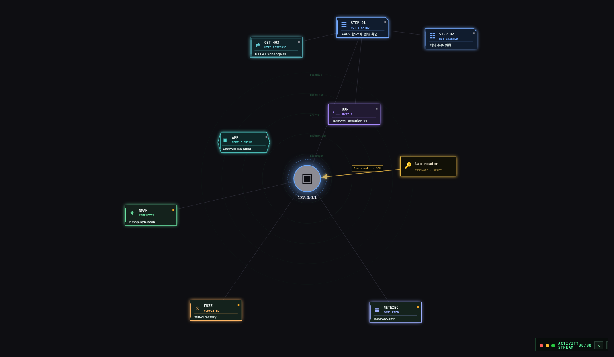

# ShadowTrace



Kali에서 진행한 조사 활동을 수집하고, 명령·대상·증거를 그래프로 연결하는 로컬 패시브 트래킹 앱입니다. 기존 터미널에서 작업한 기록과 앱에서 실행한 작업을 한 프로젝트에서 살펴볼 수 있습니다.

## 활동 기록

ShadowTrace를 실행한 상태에서 Kali 터미널을 사용하면 eBPF observer가 프로세스 생성·종료, 터미널 입출력, 소켓 연결과 파일 변경 이벤트를 수집합니다. 프로세스 계보와 TTY, 시간 정보를 이용해 터미널 세션과 명령 활동을 재구성합니다.

```text
터미널 작업 → 원시 이벤트 → 프로세스·세션·명령 활동 → 프로젝트 그래프
```

- Nmap 실행 결과는 호스트·포트·서비스와 원본 증거로 연결합니다. stdout과 선언된 XML 출력 파일을 처리합니다.
- ffuf와 curl은 대상과 출력 파일을 확인할 수 있을 때 결과를 증거로 보관합니다.
- 대상 프로젝트가 명확한 명령 활동은 도구 특성에 맞는 그래프 노드로 표시합니다. 귀속이 불명확한 활동은 원본 기록에 남깁니다.
- 수집 이벤트에는 시각, 출처, 신뢰도와 손실 상태를 함께 저장합니다. 터미널 입력은 ECHO 상태를 확인해 기록하고, 그 외에는 바이트 수만 남깁니다.

## 주요 화면

### Progress Graph

- 프로젝트에서 호스트, 서비스, 명령 실행, Runbook 단계, 자격증명, 증거와 Finding의 관계를 탐색합니다.
- Nmap, FFUF, NetExec, HTTP 요청, SSH 실행 등은 유형과 상태가 구분되는 노드로 표시합니다.
- 그래프·트리·Outline 보기, 노드 검색과 필터, 상세 Inspector를 제공합니다.
- 노드에서 관련 실행 출력과 증거를 열고, 웹 요청은 그래프 안에서 이어서 편집할 수 있습니다.

### Scan Center · Service Enumeration

- 프로젝트와 대상을 등록하고 Nmap 스캔을 실행하거나 기존 XML을 가져옵니다.
- 스캔 대기열, 실시간 출력, 중단·재실행, 스캔 간 변화 비교를 제공합니다.
- 서비스별 명령 카탈로그에서 명령을 검토하고 실행 결과를 기록합니다.
- SMB 공유 탐색, 프로토콜별 인증 확인, 대화형 터미널을 지원합니다.
- 발견한 계정은 출처와 함께 Credential Store에 기록하고 다른 화면에서 연결합니다.

### Web Testing · Exploit Research

- HTTP 요청을 작성·전송하고 응답을 저장하거나 두 응답을 비교합니다.
- SearchSploit 후보와 로컬 PoC를 조사 기록에 연결합니다.
- PoC 원본과 작업 사본, 변경 내역, 실행 출력과 증거를 함께 보관합니다.

### Runbooks · AD Information

- 대상·서비스·웹/API·모바일·클라우드 등 30개 기본 Runbook에서 점검 단계를 선택합니다.
- 단계 상태, 메모, 실행·증거 링크와 진행률을 기록합니다.
- 사용자, 그룹, 컴퓨터, 도메인과 그 관계를 등록하거나 CSV·JSON으로 가져옵니다.

### Evidence · Findings · Reports

- 파일, 스크린샷, 명령 출력과 메모를 대상·실행·발견 항목에 연결합니다.
- 증거의 출처, 취득 시각과 SHA-256을 기록하고 ZIP으로 내보냅니다.
- 보고서에 증거와 그래프 경로를 연결하고 Markdown, HTML, PDF, DOCX로 내보냅니다.

### Sessions · Operations

- Kali 데스크톱 터미널, 웹 PTY, SSH 터널의 상태와 로그를 관리합니다.
- 프로젝트 검색, 작업 이력, ZIP 백업과 VPN 연결 상태를 제공합니다.

## 시작하기

Kali Linux, Python 3.11+, Node.js, npm이 필요합니다. 패시브 수집에는 BCC Python 바인딩이 필요합니다.

```bash
sudo apt install python3-bpfcc
./scripts/install.sh
./scripts/passive-preflight.sh
./scripts/build.sh
./scripts/start.sh
```

`http://127.0.0.1:8000`에서 엽니다. `start.sh`는 마이그레이션, observer와 서버를 함께 시작하며 필요할 때 sudo 인증을 요청합니다. preflight가 커널 헤더나 BCC 문제를 표시하면 안내에 따라 준비한 뒤 다시 실행합니다.

개발 서버와 테스트:

```bash
./scripts/dev.sh
./scripts/test.sh
```

개발 UI는 `http://127.0.0.1:5173`, API는 `http://127.0.0.1:8000`입니다.

## 사용 흐름

1. 프로젝트와 대상을 등록하고 평소 쓰던 Kali 터미널에서 조사합니다.
2. Progress Graph에서 수집된 명령과 대상·서비스 연결을 확인합니다.
3. 필요한 스캔, 서비스 명령, 웹 요청과 Runbook 단계를 이어서 기록합니다.
4. 중요한 출력과 파일을 Evidence·Finding에 연결합니다.
5. Reports에서 그래프 경로와 증거를 골라 결과를 내보냅니다.

프런트엔드는 React, API는 FastAPI, 저장소는 SQLite입니다. 코드 구조와 수집 경로는 [아키텍처](docs/ARCHITECTURE.md), 파일별 안내는 [개발 가이드](docs/ENGINEERING_ONBOARDING.md)를 참고하세요.
